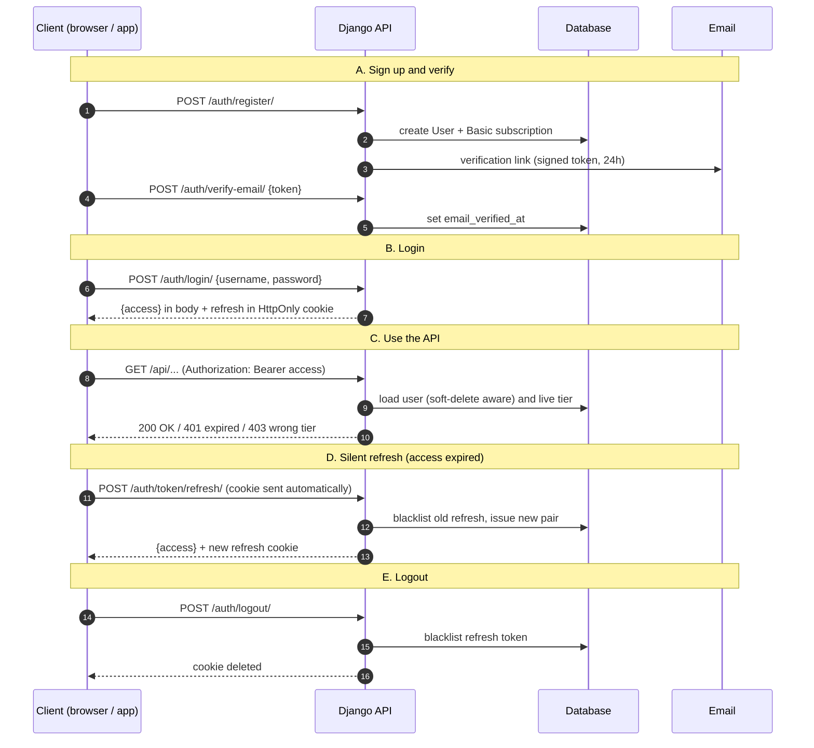

# JWT Auth + Subscription Tiers (Basic / Platinum / Diamond) for Django REST

Stack: Django + DRF + `djangorestframework-simplejwt`, built on your custom `User`
(UUID pk, soft delete) and your `config.models` mixins.

## 0. The design in one paragraph

- **Authentication** (who are you?) = short-lived JWT access token (15 min) + rotating, blacklistable refresh token (7 days).
- **Authorization by plan** (what can you use?) = a `Plan` table (basic/platinum/diamond) and a `Subscription` table linking a user to a plan with a status and billing period. A user has **many** subscriptions over time (history) but only **one live** one (enforced by a DB constraint).
- The tier is **embedded in the JWT as a claim for UI convenience**, but permission checks **read the DB**, so an upgrade, downgrade, or expiry takes effect immediately instead of when the token expires.
- Every new user gets a **Basic** subscription at registration. Paid upgrades should be driven by **payment-provider webhooks** (Stripe etc.), never by a client calling "upgrade me".

Project layout:

```
config/        settings, urls, models (mixins)
users/         User model, UserManager (services.py), auth serializers + views
subscriptions/ Plan, Subscription, services, permissions, views
```

---

## 0.1 The auth flow at a glance

This is the final flow once sections 12 (cookie refresh token) and 13 (email verification + password reset) are applied.



Step by step:

1. **Register**: creates the user (unverified), gives them the free Basic plan in the same transaction, and emails a signed verification link.
2. **Verify email**: the frontend page behind the link posts the token; the server checks signature and age (24h) and stamps `email_verified_at`.
3. **Login**: username + password are checked. Unverified users get `403 email_not_verified`. On success the server returns a 15-minute **access token** in the JSON body and sets the 7-day **refresh token** in an `HttpOnly` cookie that JavaScript can never read.
4. **Call the API**: the client sends `Authorization: Bearer <access>`. The server validates the signature and expiry, loads the user (deleted/inactive users are rejected), and permission classes check the live tier in the DB.
5. **Refresh**: when the access token expires (`401`), the client calls `/token/refresh/`. The browser attaches the cookie itself. The old refresh token is blacklisted and a new one is issued (rotation). If an attacker replays a stolen, already-used refresh token it fails.
6. **Logout**: the refresh token is blacklisted and the cookie is cleared. The short-lived access token simply expires on its own (that is the trade-off of stateless JWTs, and why it is only 15 minutes).
7. **Forgot password**: the user requests a reset email (the response is always identical, so attackers can't discover which emails exist), opens the link, submits a new password, and **every refresh token for that user is revoked**.

Token cheat sheet:

| Token                | Lifetime         | Where it lives                                  | Sent how                       | Revocable                      |
| -------------------- | ---------------- | ----------------------------------------------- | ------------------------------ | ------------------------------ |
| Access JWT           | 15 min           | JS memory (not localStorage)                    | `Authorization: Bearer`        | No, it expires fast            |
| Refresh JWT          | 7 days, rotating | `HttpOnly; Secure` cookie, path `/api/v1/auth/` | Browser attaches automatically | Yes, blacklist table           |
| Email verify token   | 24 h             | Link in email                                   | Request body                   | Dies if the email changes      |
| Password reset token | 1 h, one use     | Link in email                                   | Request body                   | Dies once the password changes |

---

## 1. Install

```bash
pip install djangorestframework djangorestframework-simplejwt
python manage.py startapp subscriptions
```

## 2. Settings changes (`config/settings.py`)

```python
from datetime import timedelta

INSTALLED_APPS = [
    "django.contrib.admin",
    "django.contrib.auth",
    "django.contrib.contenttypes",
    "django.contrib.sessions",
    "django.contrib.messages",
    "django.contrib.staticfiles",
    # third party
    "rest_framework",
    "rest_framework_simplejwt",
    "rest_framework_simplejwt.token_blacklist",  # enables logout / refresh revocation
    # local
    "users",
    "subscriptions",
]

AUTH_USER_MODEL = "users.User"   # MUST be set before your first migrate

# Remove the insecure default SECRET_KEY fallback outside local dev:
# SECRET_KEY = env("SECRET_KEY")   # no default -> app refuses to start without it

REST_FRAMEWORK = {
    "DEFAULT_AUTHENTICATION_CLASSES": (
        "rest_framework_simplejwt.authentication.JWTAuthentication",
    ),
    "DEFAULT_PERMISSION_CLASSES": (
        "rest_framework.permissions.IsAuthenticated",  # secure by default
    ),
    "DEFAULT_THROTTLE_CLASSES": (
        "rest_framework.throttling.AnonRateThrottle",
        "rest_framework.throttling.UserRateThrottle",
        "rest_framework.throttling.ScopedRateThrottle",
    ),
    "DEFAULT_THROTTLE_RATES": {
        "anon": "100/hour",
        "user": "2000/hour",
        "login": "5/min",       # brute-force protection
        "register": "10/hour",
    },
}

SIMPLE_JWT = {
    "ACCESS_TOKEN_LIFETIME": timedelta(minutes=15),
    "REFRESH_TOKEN_LIFETIME": timedelta(days=7),
    "ROTATE_REFRESH_TOKENS": True,        # every refresh issues a new refresh token
    "BLACKLIST_AFTER_ROTATION": True,     # old refresh token becomes unusable (theft detection)
    "UPDATE_LAST_LOGIN": True,
    "ALGORITHM": "HS256",
    "SIGNING_KEY": SECRET_KEY,            # or a dedicated JWT_SIGNING_KEY env var
    "AUTH_HEADER_TYPES": ("Bearer",),
    "USER_ID_FIELD": "id",                # your UUID pk (simplejwt stringifies it)
    "USER_ID_CLAIM": "user_id",
}
```

Notes:

- simplejwt loads users with `User.objects`, which is your soft-delete-aware manager, so a soft-deleted user's tokens stop working immediately.
- `is_active=False` users are also rejected by default.

---

## 3. Models

### `subscriptions/models.py`

```python
from django.conf import settings
from django.db import models
from django.db.models import Q
from django.utils import timezone
from django.utils.translation import gettext_lazy as _

from config.models import BaseModel


class Tier(models.TextChoices):
    BASIC = "basic", _("Basic")
    PLATINUM = "platinum", _("Platinum")
    DIAMOND = "diamond", _("Diamond")


# Single source of truth for ordering tiers (higher = more access).
TIER_RANK = {Tier.BASIC: 1, Tier.PLATINUM: 2, Tier.DIAMOND: 3}


class SubscriptionStatus(models.TextChoices):
    TRIALING = "trialing", _("Trialing")
    ACTIVE = "active", _("Active")
    PAST_DUE = "past_due", _("Past due")      # payment failed, grace period
    CANCELED = "canceled", _("Canceled")
    EXPIRED = "expired", _("Expired")


# Statuses that grant access. Used both in the DB constraint and in queries.
LIVE_STATUSES = (
    SubscriptionStatus.TRIALING,
    SubscriptionStatus.ACTIVE,
    SubscriptionStatus.PAST_DUE,
)


class BillingCycle(models.TextChoices):
    MONTHLY = "monthly", _("Monthly")
    YEARLY = "yearly", _("Yearly")


class Plan(BaseModel):
    """
    Catalog entry. Three rows: basic, platinum, diamond.
    Prices/limits live in data, not code, so you can change them without a deploy.
    """

    tier = models.CharField(
        max_length=20, choices=Tier.choices, unique=True, verbose_name=_("Tier")
    )
    name = models.CharField(max_length=100, verbose_name=_("Name"))
    description = models.TextField(blank=True, verbose_name=_("Description"))
    price_monthly = models.DecimalField(max_digits=10, decimal_places=2, default=0)
    price_yearly = models.DecimalField(max_digits=10, decimal_places=2, default=0)
    currency = models.CharField(max_length=3, default="USD")

    # Feature limits, e.g. {"max_projects": 3, "api_calls_per_day": 1000, "export": false}
    limits = models.JSONField(default=dict, blank=True)

    # ID of this plan in your payment provider (Stripe price/product id)
    provider_price_id_monthly = models.CharField(max_length=255, blank=True)
    provider_price_id_yearly = models.CharField(max_length=255, blank=True)

    is_active = models.BooleanField(default=True)

    class Meta:
        verbose_name = _("Plan")
        verbose_name_plural = _("Plans")

    def __str__(self):
        return self.name

    @property
    def rank(self) -> int:
        return TIER_RANK[self.tier]


class Subscription(BaseModel):
    """
    A user's subscription period. History is preserved: changing plan closes the
    old row and opens a new one. At most ONE live row per user (DB-enforced).
    """

    user = models.ForeignKey(
        settings.AUTH_USER_MODEL,
        on_delete=models.CASCADE,
        related_name="subscriptions",
    )
    plan = models.ForeignKey(
        Plan, on_delete=models.PROTECT, related_name="subscriptions"
    )
    status = models.CharField(
        max_length=20,
        choices=SubscriptionStatus.choices,
        default=SubscriptionStatus.ACTIVE,
        db_index=True,
    )
    billing_cycle = models.CharField(
        max_length=10, choices=BillingCycle.choices, default=BillingCycle.MONTHLY
    )

    started_at = models.DateTimeField(default=timezone.now)
    current_period_start = models.DateTimeField(default=timezone.now)
    # NULL = never expires (the free Basic plan)
    current_period_end = models.DateTimeField(null=True, blank=True)
    trial_ends_at = models.DateTimeField(null=True, blank=True)
    cancel_at_period_end = models.BooleanField(default=False)
    ended_at = models.DateTimeField(null=True, blank=True)

    # Payment provider linkage (Stripe subscription/customer ids)
    provider = models.CharField(max_length=30, blank=True)
    provider_customer_id = models.CharField(max_length=255, blank=True)
    provider_subscription_id = models.CharField(
        max_length=255, blank=True, db_index=True
    )

    class Meta:
        verbose_name = _("Subscription")
        verbose_name_plural = _("Subscriptions")
        ordering = ["-created_at"]
        constraints = [
            models.UniqueConstraint(
                fields=["user"],
                condition=Q(status__in=[s.value for s in LIVE_STATUSES])
                & Q(deleted_at__isnull=True),
                name="one_live_subscription_per_user",
            ),
        ]
        indexes = [
            models.Index(fields=["user", "status"], name="sub_user_status_idx"),
            models.Index(fields=["current_period_end"], name="sub_period_end_idx"),
        ]

    def __str__(self):
        return f"{self.user_id} -> {self.plan.tier} ({self.status})"

    @property
    def is_live(self) -> bool:
        if self.status not in LIVE_STATUSES:
            return False
        return self.current_period_end is None or self.current_period_end > timezone.now()
```

Why this shape:

- `Plan` is data, so pricing and limits change without a deploy.
- `Subscription` keeps history (audit, refunds, analytics) instead of overwriting a `tier` column on the user.
- The partial unique constraint makes "two active subscriptions at once" impossible, even under race conditions.
- `PAST_DUE` is treated as live, which gives a grace period when a card fails; remove it from `LIVE_STATUSES` for a hard cutoff.

### Convenience on `User` (`users/models.py`)

Add these two members to your `User` class (import inside the method to avoid circular imports):

```python
    @property
    def tier(self) -> str:
        from subscriptions.services import get_user_tier
        return get_user_tier(self)

    @property
    def subscription(self):
        from subscriptions.services import get_live_subscription
        return get_live_subscription(self)
```

---

## 4. Services (business logic, not in views)

### `subscriptions/services.py`

```python
from datetime import timedelta

from django.db import transaction
from django.db.models import Q
from django.utils import timezone

from .models import (
    LIVE_STATUSES,
    BillingCycle,
    Plan,
    Subscription,
    SubscriptionStatus,
    Tier,
)


def get_live_subscription(user) -> Subscription | None:
    now = timezone.now()
    return (
        Subscription.objects.select_related("plan")
        .filter(user=user, status__in=LIVE_STATUSES)
        .filter(Q(current_period_end__isnull=True) | Q(current_period_end__gt=now))
        .order_by("-created_at")
        .first()
    )


def get_user_tier(user) -> str:
    sub = get_live_subscription(user)
    return sub.plan.tier if sub else Tier.BASIC


@transaction.atomic
def assign_default_plan(user) -> Subscription:
    """Called at registration: every user starts on Basic (free, never expires)."""
    plan = Plan.objects.get(tier=Tier.BASIC)
    return Subscription.objects.create(
        user=user,
        plan=plan,
        status=SubscriptionStatus.ACTIVE,
        current_period_end=None,
    )


@transaction.atomic
def change_plan(
    user,
    tier: str,
    billing_cycle: str = BillingCycle.MONTHLY,
    *,
    provider: str = "",
    provider_customer_id: str = "",
    provider_subscription_id: str = "",
) -> Subscription:
    """
    Close the current live subscription and open a new one on `tier`.
    Call this from your payment webhook handler after a successful payment,
    NOT directly from a client-facing endpoint.
    """
    plan = Plan.objects.get(tier=tier, is_active=True)
    now = timezone.now()

    live = Subscription.objects.select_for_update().filter(
        user=user, status__in=LIVE_STATUSES
    )
    live.update(status=SubscriptionStatus.CANCELED, ended_at=now)

    if tier == Tier.BASIC:
        period_end = None
    elif billing_cycle == BillingCycle.YEARLY:
        period_end = now + timedelta(days=365)
    else:
        period_end = now + timedelta(days=30)

    return Subscription.objects.create(
        user=user,
        plan=plan,
        status=SubscriptionStatus.ACTIVE,
        billing_cycle=billing_cycle,
        current_period_start=now,
        current_period_end=period_end,
        provider=provider,
        provider_customer_id=provider_customer_id,
        provider_subscription_id=provider_subscription_id,
    )


def expire_overdue_subscriptions() -> int:
    """
    Run periodically (Celery beat / cron). Expires paid subscriptions past their
    period end and drops those users back to Basic.
    """
    now = timezone.now()
    overdue = Subscription.objects.filter(
        status__in=LIVE_STATUSES, current_period_end__lt=now
    ).select_related("user")
    count = 0
    for sub in overdue:
        sub.status = SubscriptionStatus.EXPIRED
        sub.ended_at = now
        sub.save(update_fields=["status", "ended_at", "updated_at"])
        assign_default_plan(sub.user)
        count += 1
    return count
```

### Seed the three plans: `subscriptions/management/commands/seed_plans.py`

Create empty `__init__.py` in both `management/` and `management/commands/`.

```python
from django.core.management.base import BaseCommand

from subscriptions.models import Plan, Tier

PLANS = [
    dict(tier=Tier.BASIC, name="Basic", price_monthly=0, price_yearly=0,
         limits={"max_projects": 3, "api_calls_per_day": 1_000, "export": False}),
    dict(tier=Tier.PLATINUM, name="Platinum", price_monthly=19, price_yearly=190,
         limits={"max_projects": 25, "api_calls_per_day": 25_000, "export": True}),
    dict(tier=Tier.DIAMOND, name="Diamond", price_monthly=49, price_yearly=490,
         limits={"max_projects": None, "api_calls_per_day": None, "export": True}),
]


class Command(BaseCommand):
    help = "Create or update the Basic / Platinum / Diamond plans"

    def handle(self, *args, **options):
        for data in PLANS:
            tier = data.pop("tier")
            plan, created = Plan.objects.update_or_create(tier=tier, defaults=data)
            self.stdout.write(f"{'Created' if created else 'Updated'} {plan.name}")
```

---

## 5. Permissions (tier gating)

### `subscriptions/permissions.py`

```python
from rest_framework.permissions import BasePermission

from .models import TIER_RANK, Tier
from .services import get_user_tier


def tier_required(min_tier: str):
    """Factory: `permission_classes = [tier_required(Tier.PLATINUM)]`"""

    class _HasMinTier(BasePermission):
        message = f"This feature requires the {min_tier} plan or higher."

        def has_permission(self, request, view):
            user = request.user
            if not (user and user.is_authenticated):
                return False
            return TIER_RANK[get_user_tier(user)] >= TIER_RANK[min_tier]

    _HasMinTier.__name__ = f"HasMinTier_{min_tier}"
    return _HasMinTier


IsPlatinumOrHigher = tier_required(Tier.PLATINUM)
IsDiamond = tier_required(Tier.DIAMOND)
```

Failed checks return `403` with the message above; the frontend can show an upgrade prompt.

---

## 6. Auth: serializers

### `users/serializers.py`

```python
from django.contrib.auth import get_user_model
from django.contrib.auth.password_validation import validate_password
from django.db import transaction
from rest_framework import serializers
from rest_framework_simplejwt.serializers import TokenObtainPairSerializer

from subscriptions.services import assign_default_plan

User = get_user_model()


class RegisterSerializer(serializers.ModelSerializer):
    password = serializers.CharField(write_only=True, min_length=8, style={"input_type": "password"})

    class Meta:
        model = User
        fields = ("id", "username", "email", "first_name", "last_name", "password")
        read_only_fields = ("id",)

    def validate_email(self, value):
        value = value.lower()
        if User.all_objects.filter(email__iexact=value).exists():
            raise serializers.ValidationError("A user with this email already exists.")
        return value

    def validate(self, attrs):
        # Runs Django's AUTH_PASSWORD_VALIDATORS with user context
        validate_password(attrs["password"], user=User(**{k: v for k, v in attrs.items() if k != "password"}))
        return attrs

    @transaction.atomic
    def create(self, validated_data):
        password = validated_data.pop("password")
        user = User.objects.create_user(password=password, **validated_data)
        assign_default_plan(user)
        return user


class UserSerializer(serializers.ModelSerializer):
    tier = serializers.CharField(read_only=True)

    class Meta:
        model = User
        fields = ("id", "username", "email", "first_name", "last_name", "tier", "date_joined_alias")
        read_only_fields = fields

    # `date_joined_alias` -> your model has created_at; expose that instead
    date_joined_alias = serializers.DateTimeField(source="created_at", read_only=True)


class CustomTokenObtainPairSerializer(TokenObtainPairSerializer):
    """Adds non-sensitive claims. Keep claims small; never put secrets in a JWT."""

    @classmethod
    def get_token(cls, user):
        token = super().get_token(user)
        token["username"] = user.username
        token["tier"] = user.tier   # UI hint only; the server re-checks the DB
        return token


class ChangePasswordSerializer(serializers.Serializer):
    old_password = serializers.CharField(write_only=True)
    new_password = serializers.CharField(write_only=True)

    def validate_old_password(self, value):
        if not self.context["request"].user.check_password(value):
            raise serializers.ValidationError("Old password is incorrect.")
        return value

    def validate_new_password(self, value):
        validate_password(value, user=self.context["request"].user)
        return value
```

(Delete the awkward `date_joined_alias` line in `UserSerializer.Meta.fields` if you'd rather expose `created_at` directly: `fields = (..., "tier", "created_at")`.)

## 7. Auth: views

### `users/views.py`

```python
from django.contrib.auth import get_user_model
from rest_framework import generics, status
from rest_framework.permissions import AllowAny, IsAuthenticated
from rest_framework.response import Response
from rest_framework.views import APIView
from rest_framework_simplejwt.exceptions import TokenError
from rest_framework_simplejwt.tokens import RefreshToken
from rest_framework_simplejwt.views import TokenObtainPairView

from .serializers import (
    ChangePasswordSerializer,
    CustomTokenObtainPairSerializer,
    RegisterSerializer,
    UserSerializer,
)

User = get_user_model()


class RegisterView(generics.CreateAPIView):
    serializer_class = RegisterSerializer
    permission_classes = [AllowAny]
    throttle_scope = "register"


class LoginView(TokenObtainPairView):
    serializer_class = CustomTokenObtainPairSerializer
    throttle_scope = "login"


class LogoutView(APIView):
    """Blacklists the refresh token so it can never mint new access tokens."""

    permission_classes = [IsAuthenticated]

    def post(self, request):
        try:
            RefreshToken(request.data["refresh"]).blacklist()
        except (KeyError, TokenError):
            return Response({"detail": "Invalid or missing refresh token."}, status=status.HTTP_400_BAD_REQUEST)
        return Response(status=status.HTTP_205_RESET_CONTENT)


class MeView(generics.RetrieveAPIView):
    serializer_class = UserSerializer

    def get_object(self):
        return self.request.user


class ChangePasswordView(APIView):
    def post(self, request):
        ser = ChangePasswordSerializer(data=request.data, context={"request": request})
        ser.is_valid(raise_exception=True)
        request.user.set_password(ser.validated_data["new_password"])
        request.user.save(update_fields=["password"])
        # Revoke all outstanding refresh tokens so other sessions are signed out
        from rest_framework_simplejwt.token_blacklist.models import (
            BlacklistedToken,
            OutstandingToken,
        )
        for t in OutstandingToken.objects.filter(user=request.user):
            BlacklistedToken.objects.get_or_create(token=t)
        return Response({"detail": "Password updated. Please log in again."})
```

### `subscriptions/views.py`

```python
from rest_framework import serializers
from rest_framework.response import Response
from rest_framework.views import APIView

from .models import Plan
from .permissions import IsDiamond, IsPlatinumOrHigher
from .services import get_live_subscription


class PlanSerializer(serializers.ModelSerializer):
    class Meta:
        model = Plan
        fields = ("tier", "name", "description", "price_monthly", "price_yearly", "currency", "limits")


class SubscriptionSerializer(serializers.Serializer):
    tier = serializers.CharField(source="plan.tier")
    status = serializers.CharField()
    billing_cycle = serializers.CharField()
    current_period_end = serializers.DateTimeField()
    cancel_at_period_end = serializers.BooleanField()


class PlanListView(APIView):
    permission_classes = []          # public pricing page
    authentication_classes = []

    def get(self, request):
        plans = Plan.objects.filter(is_active=True).order_by("price_monthly")
        return Response(PlanSerializer(plans, many=True).data)


class MySubscriptionView(APIView):
    def get(self, request):
        sub = get_live_subscription(request.user)
        return Response(SubscriptionSerializer(sub).data if sub else {"tier": "basic"})


# --- Example gated endpoints -------------------------------------------------
class PlatinumFeatureView(APIView):
    permission_classes = [IsPlatinumOrHigher]

    def get(self, request):
        return Response({"detail": "Platinum+ feature unlocked."})


class DiamondFeatureView(APIView):
    permission_classes = [IsDiamond]

    def get(self, request):
        return Response({"detail": "Diamond-only feature unlocked."})
```

## 8. URLs

### `users/urls.py`

```python
from django.urls import path
from rest_framework_simplejwt.views import TokenRefreshView, TokenVerifyView

from .views import ChangePasswordView, LoginView, LogoutView, MeView, RegisterView

urlpatterns = [
    path("register/", RegisterView.as_view(), name="register"),
    path("login/", LoginView.as_view(), name="login"),
    path("token/refresh/", TokenRefreshView.as_view(), name="token_refresh"),
    path("token/verify/", TokenVerifyView.as_view(), name="token_verify"),
    path("logout/", LogoutView.as_view(), name="logout"),
    path("me/", MeView.as_view(), name="me"),
    path("change-password/", ChangePasswordView.as_view(), name="change_password"),
]
```

### `subscriptions/urls.py`

```python
from django.urls import path

from .views import DiamondFeatureView, MySubscriptionView, PlanListView, PlatinumFeatureView

urlpatterns = [
    path("plans/", PlanListView.as_view(), name="plans"),
    path("me/", MySubscriptionView.as_view(), name="my_subscription"),
    path("demo/platinum/", PlatinumFeatureView.as_view()),
    path("demo/diamond/", DiamondFeatureView.as_view()),
]
```

### `config/urls.py`

```python
from django.contrib import admin
from django.urls import include, path

urlpatterns = [
    path("admin/", admin.site.urls),
    path("api/v1/auth/", include("users.urls")),
    path("api/v1/subscriptions/", include("subscriptions.urls")),
]
```

---

## 9. Migrate and run (order matters)

```bash
python manage.py makemigrations users subscriptions
python manage.py migrate
python manage.py seed_plans
python manage.py createsuperuser
python manage.py runserver
```

If you already migrated with the default `auth.User` before setting `AUTH_USER_MODEL`, delete the dev DB and migrations and start over. Swapping the user model mid-project is painful.

## 10. Try it

```bash
# register
curl -X POST localhost:8000/api/v1/auth/register/ -H "Content-Type: application/json" \
  -d '{"username":"sam","email":"sam@example.com","password":"S0me-Str0ng-Pass"}'

# login -> {"access": "...", "refresh": "..."}
curl -X POST localhost:8000/api/v1/auth/login/ -H "Content-Type: application/json" \
  -d '{"username":"sam","password":"S0me-Str0ng-Pass"}'

# call an endpoint
curl localhost:8000/api/v1/auth/me/ -H "Authorization: Bearer <access>"

# gated endpoint (403 for Basic users)
curl localhost:8000/api/v1/subscriptions/demo/platinum/ -H "Authorization: Bearer <access>"

# refresh / logout
curl -X POST localhost:8000/api/v1/auth/token/refresh/ -H "Content-Type: application/json" -d '{"refresh":"<refresh>"}'
curl -X POST localhost:8000/api/v1/auth/logout/ -H "Authorization: Bearer <access>" -H "Content-Type: application/json" -d '{"refresh":"<refresh>"}'
```

To test an upgrade locally: `python manage.py shell` then
`from subscriptions.services import change_plan; change_plan(User.objects.get(username="sam"), "platinum")`.

## 11. Tests worth writing first (`subscriptions/tests.py`)

```python
from django.core.management import call_command
from django.test import TestCase
from rest_framework.test import APIClient

from subscriptions.services import change_plan


class TierGatingTests(TestCase):
    def setUp(self):
        call_command("seed_plans")
        self.client = APIClient()
        self.client.post("/api/v1/auth/register/", {"username": "a", "email": "a@x.com", "password": "S0me-Str0ng-Pass"})
        res = self.client.post("/api/v1/auth/login/", {"username": "a", "password": "S0me-Str0ng-Pass"})
        self.client.credentials(HTTP_AUTHORIZATION=f"Bearer {res.data['access']}")

    def test_basic_blocked_from_platinum(self):
        self.assertEqual(self.client.get("/api/v1/subscriptions/demo/platinum/").status_code, 403)

    def test_upgrade_takes_effect_without_new_token(self):
        from django.contrib.auth import get_user_model
        change_plan(get_user_model().objects.get(username="a"), "platinum")
        self.assertEqual(self.client.get("/api/v1/subscriptions/demo/platinum/").status_code, 200)
        self.assertEqual(self.client.get("/api/v1/subscriptions/demo/diamond/").status_code, 403)
```

---

## 12. Refresh token in an HttpOnly cookie

Why: if the refresh token is returned in JSON and stored in `localStorage`, any XSS bug lets an attacker steal a 7-day credential. In an `HttpOnly` cookie, JavaScript cannot read it. The access token stays in memory (a JS variable) only.

### Settings (`config/settings.py`, below `SIMPLE_JWT`)

```python
AUTH_COOKIE_REFRESH = "refresh_token"
AUTH_COOKIE_SECURE = not DEBUG          # True in production (HTTPS only)
AUTH_COOKIE_SAMESITE = "Lax"            # "None" only for a cross-site frontend (requires Secure + CSRF defense below)
AUTH_COOKIE_PATH = "/api/v1/auth/"      # cookie is only sent to auth endpoints, not every API call
AUTH_COOKIE_MAX_AGE = int(SIMPLE_JWT["REFRESH_TOKEN_LIFETIME"].total_seconds())

# Throttle scope used by the email endpoints in section 13
REST_FRAMEWORK["DEFAULT_THROTTLE_RATES"]["email"] = "5/hour"

# If your frontend is on another origin (pip install django-cors-headers):
# CORS_ALLOWED_ORIGINS = ["https://app.example.com"]
# CORS_ALLOW_CREDENTIALS = True
```

### `users/cookies.py`

```python
from django.conf import settings


def set_refresh_cookie(response, refresh_token: str) -> None:
    response.set_cookie(
        key=settings.AUTH_COOKIE_REFRESH,
        value=refresh_token,
        max_age=settings.AUTH_COOKIE_MAX_AGE,
        httponly=True,
        secure=settings.AUTH_COOKIE_SECURE,
        samesite=settings.AUTH_COOKIE_SAMESITE,
        path=settings.AUTH_COOKIE_PATH,
    )


def delete_refresh_cookie(response) -> None:
    response.delete_cookie(
        key=settings.AUTH_COOKIE_REFRESH,
        path=settings.AUTH_COOKIE_PATH,
        samesite=settings.AUTH_COOKIE_SAMESITE,
    )
```

### Add to `users/serializers.py`

```python
from django.conf import settings
from rest_framework_simplejwt.exceptions import InvalidToken
from rest_framework_simplejwt.serializers import TokenRefreshSerializer


class CookieTokenRefreshSerializer(TokenRefreshSerializer):
    """Reads the refresh token from the cookie instead of the request body."""

    refresh = serializers.CharField(required=False)

    def validate(self, attrs):
        attrs["refresh"] = self.context["request"].COOKIES.get(settings.AUTH_COOKIE_REFRESH)
        if not attrs["refresh"]:
            raise InvalidToken("No refresh token cookie found.")
        return super().validate(attrs)
```

### Replace the login / refresh / logout views in `users/views.py`

```python
from django.conf import settings
from rest_framework_simplejwt.views import TokenRefreshView

from .cookies import delete_refresh_cookie, set_refresh_cookie
from .serializers import CookieTokenRefreshSerializer


class LoginView(TokenObtainPairView):
    serializer_class = CustomTokenObtainPairSerializer
    throttle_scope = "login"

    def finalize_response(self, request, response, *args, **kwargs):
        if response.status_code == status.HTTP_200_OK and "refresh" in response.data:
            set_refresh_cookie(response, response.data.pop("refresh"))  # move to cookie, hide from body
        return super().finalize_response(request, response, *args, **kwargs)


class CookieTokenRefreshView(TokenRefreshView):
    serializer_class = CookieTokenRefreshSerializer

    def finalize_response(self, request, response, *args, **kwargs):
        if response.status_code == status.HTTP_200_OK and "refresh" in response.data:
            set_refresh_cookie(response, response.data.pop("refresh"))  # rotated token
        return super().finalize_response(request, response, *args, **kwargs)


class LogoutView(APIView):
    """Works even if the access token already expired, so it needs no auth."""

    permission_classes = [AllowAny]
    authentication_classes = []

    def post(self, request):
        raw = request.COOKIES.get(settings.AUTH_COOKIE_REFRESH)
        if raw:
            try:
                RefreshToken(raw).blacklist()
            except TokenError:
                pass  # already invalid: nothing to revoke
        response = Response(status=status.HTTP_205_RESET_CONTENT)
        delete_refresh_cookie(response)
        return response
```

In `users/urls.py`, swap the refresh route to `CookieTokenRefreshView.as_view()` and drop `TokenVerifyView` if you don't need it.

### Frontend contract

```js
// every request to the API must include credentials so the cookie is sent/stored
fetch("https://api.example.com/api/v1/auth/login/", {
  method: "POST",
  credentials: "include",
  headers: { "Content-Type": "application/json" },
  body: JSON.stringify({ username, password }),
});
// -> response body: { access: "..." }  (keep in memory, never localStorage)
// on a 401: POST /auth/token/refresh/ with credentials: "include", retry once with the new access token
// on page load: call refresh once to restore the session (access token is gone after a reload)
```

### CSRF note

Cookies are sent automatically, so refresh and logout are CSRF targets in principle. With `SameSite=Lax` (and the cookie path limited to `/api/v1/auth/`) cross-site POSTs don't carry the cookie, which covers the common same-site setup (e.g. `app.example.com` + `api.example.com`). If you must use `SameSite=None` for a truly cross-site frontend, add a CSRF defense: require a custom header on those two endpoints (e.g. `X-Requested-With: XMLHttpRequest`, which cross-site forms can't set and CORS will block) or use Django's CSRF token flow.

---

## 13. Email verification + password reset

### 13.1 Model and manager changes

`users/models.py`, add to `User`:

```python
    email_verified_at = models.DateTimeField(
        null=True,
        blank=True,
        verbose_name=_("Email Verified At"),
    )

    @property
    def is_email_verified(self) -> bool:
        return self.email_verified_at is not None
```

`users/services.py`, in `UserManager.create_superuser` add (and `from django.utils import timezone` at the top) so admins aren't locked out:

```python
        extra_fields.setdefault("email_verified_at", timezone.now())
```

Then run `makemigrations users && migrate`.

### 13.2 Settings

```python
FRONTEND_URL = env("FRONTEND_URL", default="http://localhost:3000")
EMAIL_VERIFY_MAX_AGE = 60 * 60 * 24   # 24 hours
PASSWORD_RESET_TIMEOUT = 60 * 60      # 1 hour (Django's built-in setting used by the reset token)
```

### 13.3 Tokens and emails: `users/tokens.py`

```python
from django.conf import settings
from django.contrib.auth import get_user_model
from django.contrib.auth.tokens import default_token_generator
from django.core import signing
from django.core.exceptions import ValidationError as DjangoValidationError
from django.core.mail import send_mail
from django.utils.encoding import force_bytes, force_str
from django.utils.http import urlsafe_base64_decode, urlsafe_base64_encode
from rest_framework_simplejwt.token_blacklist.models import BlacklistedToken, OutstandingToken

User = get_user_model()
EMAIL_VERIFY_SALT = "users.email-verify"


# ---- email verification (signed, time-limited, tied to the current email) ----
def make_email_verification_token(user) -> str:
    return signing.dumps({"uid": str(user.pk), "email": user.email}, salt=EMAIL_VERIFY_SALT)


def user_from_email_verification_token(token: str):
    """Returns the user or raises ValueError. Changing the email invalidates old links."""
    try:
        data = signing.loads(token, salt=EMAIL_VERIFY_SALT, max_age=settings.EMAIL_VERIFY_MAX_AGE)
        return User.objects.get(pk=data["uid"], email=data["email"])
    except (signing.BadSignature, User.DoesNotExist, DjangoValidationError, KeyError):
        raise ValueError("Invalid or expired token.")


def send_verification_email(user) -> None:
    link = f"{settings.FRONTEND_URL}/verify-email?token={make_email_verification_token(user)}"
    send_mail(
        subject="Verify your email",
        message=f"Hi {user.username},\n\nConfirm your email address:\n{link}\n\nThis link expires in 24 hours.",
        from_email=settings.DEFAULT_FROM_EMAIL,
        recipient_list=[user.email],
    )


# ---- password reset (Django's generator: single use, dies when the password changes) ----
def send_password_reset_email(user) -> None:
    uid = urlsafe_base64_encode(force_bytes(user.pk))
    token = default_token_generator.make_token(user)
    link = f"{settings.FRONTEND_URL}/reset-password?uid={uid}&token={token}"
    send_mail(
        subject="Reset your password",
        message=f"Hi {user.username},\n\nReset your password:\n{link}\n\nIf you didn't ask for this, ignore this email.",
        from_email=settings.DEFAULT_FROM_EMAIL,
        recipient_list=[user.email],
    )


def user_from_reset_credentials(uidb64: str, token: str):
    try:
        user = User.objects.get(pk=force_str(urlsafe_base64_decode(uidb64)))
    except (User.DoesNotExist, ValueError, TypeError, OverflowError, DjangoValidationError):
        raise ValueError("Invalid reset link.")
    if not default_token_generator.check_token(user, token):
        raise ValueError("Invalid or expired reset link.")
    return user


def revoke_all_refresh_tokens(user) -> None:
    """Sign the user out of every device."""
    for t in OutstandingToken.objects.filter(user=user):
        BlacklistedToken.objects.get_or_create(token=t)
```

You can now replace the inline loop in `ChangePasswordView` with `revoke_all_refresh_tokens(request.user)`.

### 13.4 Send the email at registration

In `RegisterSerializer.create` (`users/serializers.py`):

```python
from .tokens import send_verification_email

    @transaction.atomic
    def create(self, validated_data):
        password = validated_data.pop("password")
        user = User.objects.create_user(password=password, **validated_data)
        assign_default_plan(user)
        # only send once the transaction is committed
        transaction.on_commit(lambda: send_verification_email(user))
        return user
```

### 13.5 Block login until verified

Update `CustomTokenObtainPairSerializer` in `users/serializers.py`:

```python
from rest_framework.exceptions import AuthenticationFailed


class CustomTokenObtainPairSerializer(TokenObtainPairSerializer):
    @classmethod
    def get_token(cls, user):
        token = super().get_token(user)
        token["username"] = user.username
        token["tier"] = user.tier
        return token

    def validate(self, attrs):
        data = super().validate(attrs)          # checks credentials first
        if not self.user.is_email_verified:
            raise AuthenticationFailed(
                "Please verify your email before logging in.", code="email_not_verified"
            )
        return data
```

The credentials are checked first, so a wrong password never reveals whether an account is verified.

### 13.6 Serializers (add to `users/serializers.py`)

```python
from .tokens import user_from_email_verification_token, user_from_reset_credentials


class VerifyEmailSerializer(serializers.Serializer):
    token = serializers.CharField()

    def validate(self, attrs):
        try:
            attrs["user"] = user_from_email_verification_token(attrs["token"])
        except ValueError as exc:
            raise serializers.ValidationError({"token": str(exc)})
        return attrs


class EmailOnlySerializer(serializers.Serializer):
    email = serializers.EmailField()


class PasswordResetConfirmSerializer(serializers.Serializer):
    uid = serializers.CharField()
    token = serializers.CharField()
    new_password = serializers.CharField(write_only=True)

    def validate(self, attrs):
        try:
            user = user_from_reset_credentials(attrs["uid"], attrs["token"])
        except ValueError as exc:
            raise serializers.ValidationError({"token": str(exc)})
        validate_password(attrs["new_password"], user=user)
        attrs["user"] = user
        return attrs
```

### 13.7 Views (add to `users/views.py`)

```python
from django.utils import timezone

from .serializers import EmailOnlySerializer, PasswordResetConfirmSerializer, VerifyEmailSerializer
from .tokens import revoke_all_refresh_tokens, send_password_reset_email, send_verification_email


class _PublicEmailView(APIView):
    permission_classes = [AllowAny]
    authentication_classes = []
    throttle_scope = "email"


class VerifyEmailView(_PublicEmailView):
    def post(self, request):
        ser = VerifyEmailSerializer(data=request.data)
        ser.is_valid(raise_exception=True)
        user = ser.validated_data["user"]
        if not user.is_email_verified:
            user.email_verified_at = timezone.now()
            user.save(update_fields=["email_verified_at", "updated_at"])
        return Response({"detail": "Email verified. You can now log in."})


class ResendVerificationView(_PublicEmailView):
    def post(self, request):
        ser = EmailOnlySerializer(data=request.data)
        ser.is_valid(raise_exception=True)
        user = User.objects.filter(email__iexact=ser.validated_data["email"]).first()
        if user and not user.is_email_verified:
            send_verification_email(user)
        # identical response whether or not the account exists (no user enumeration)
        return Response({"detail": "If that account needs verification, an email has been sent."})


class PasswordResetRequestView(_PublicEmailView):
    def post(self, request):
        ser = EmailOnlySerializer(data=request.data)
        ser.is_valid(raise_exception=True)
        user = User.objects.filter(
            email__iexact=ser.validated_data["email"], is_active=True
        ).first()
        if user:
            send_password_reset_email(user)
        return Response({"detail": "If that email is registered, a reset link has been sent."})


class PasswordResetConfirmView(_PublicEmailView):
    def post(self, request):
        ser = PasswordResetConfirmSerializer(data=request.data)
        ser.is_valid(raise_exception=True)
        user = ser.validated_data["user"]
        user.set_password(ser.validated_data["new_password"])
        # a successful reset also proves ownership of the email
        if not user.is_email_verified:
            user.email_verified_at = timezone.now()
        user.save()
        revoke_all_refresh_tokens(user)
        return Response({"detail": "Password reset. Please log in with your new password."})
```

### 13.8 URLs (`users/urls.py`)

```python
from .views import (
    ChangePasswordView, CookieTokenRefreshView, LoginView, LogoutView, MeView,
    PasswordResetConfirmView, PasswordResetRequestView, RegisterView,
    ResendVerificationView, VerifyEmailView,
)

urlpatterns = [
    path("register/", RegisterView.as_view(), name="register"),
    path("verify-email/", VerifyEmailView.as_view(), name="verify_email"),
    path("resend-verification/", ResendVerificationView.as_view(), name="resend_verification"),
    path("login/", LoginView.as_view(), name="login"),
    path("token/refresh/", CookieTokenRefreshView.as_view(), name="token_refresh"),
    path("logout/", LogoutView.as_view(), name="logout"),
    path("me/", MeView.as_view(), name="me"),
    path("change-password/", ChangePasswordView.as_view(), name="change_password"),
    path("password-reset/", PasswordResetRequestView.as_view(), name="password_reset"),
    path("password-reset/confirm/", PasswordResetConfirmView.as_view(), name="password_reset_confirm"),
]
```

In dev, `EMAIL_BACKEND` already defaults to the console backend in your settings, so verification and reset links print in the terminal.

---

## 14. Trying the full flow (updated)

```bash
# 1. register -> a verification link is printed in the runserver console
curl -X POST localhost:8000/api/v1/auth/register/ -H "Content-Type: application/json" \
  -d '{"username":"sam","email":"sam@example.com","password":"S0me-Str0ng-Pass"}'

# 2. login before verifying -> 401/403 "email_not_verified"
# 3. verify with the token from the link
curl -X POST localhost:8000/api/v1/auth/verify-email/ -H "Content-Type: application/json" -d '{"token":"<token>"}'

# 4. login; -c saves the refresh cookie. Body only has "access"
curl -c cookies.txt -X POST localhost:8000/api/v1/auth/login/ -H "Content-Type: application/json" \
  -d '{"username":"sam","password":"S0me-Str0ng-Pass"}'

# 5. call the API
curl localhost:8000/api/v1/auth/me/ -H "Authorization: Bearer <access>"

# 6. refresh: -b sends the cookie, -c stores the rotated one
curl -b cookies.txt -c cookies.txt -X POST localhost:8000/api/v1/auth/token/refresh/

# 7. logout
curl -b cookies.txt -c cookies.txt -X POST localhost:8000/api/v1/auth/logout/

# 8. password reset
curl -X POST localhost:8000/api/v1/auth/password-reset/ -H "Content-Type: application/json" -d '{"email":"sam@example.com"}'
curl -X POST localhost:8000/api/v1/auth/password-reset/confirm/ -H "Content-Type: application/json" \
  -d '{"uid":"<uid>","token":"<token>","new_password":"An0ther-Str0ng-Pass"}'
```

Update the tests from section 11: in `setUp`, mark the user verified before logging in (`User.objects.filter(username="a").update(email_verified_at=timezone.now())`), and read the refresh token from `res.cookies["refresh_token"].value` instead of the response body. To assert the verification email in tests, wrap registration in `with self.captureOnCommitCallbacks(execute=True):` and check `django.core.mail.outbox`.

---

## 15. Industry-standard hardening checklist (what to do next)

1. **Payments**: integrate Stripe Checkout + a `/webhooks/stripe/` endpoint that verifies the signature and calls `change_plan()` / marks `PAST_DUE` / `CANCELED`. Handle webhook idempotency (store processed event ids).
2. **Refresh token storage**: done in section 12 (HttpOnly cookie). Remember to keep the access token in memory only.
3. **Periodic job**: schedule `expire_overdue_subscriptions()` (Celery beat or cron) and `python manage.py flushexpiredtokens` for the blacklist tables.
4. **Production settings**: `DEBUG=False`, real `SECRET_KEY` (no default), `SECURE_SSL_REDIRECT`, `SESSION_COOKIE_SECURE`, `CSRF_COOKIE_SECURE`, `SECURE_HSTS_SECONDS`, CORS allow-list (`django-cors-headers`) for your frontend origin only.
5. **Email verification and password reset**: done in section 13. Next: send emails from a background worker (Celery) instead of inside the request, and use HTML templates.
6. **Rate limits per plan**: subclass `UserRateThrottle` and read `plan.limits["api_calls_per_day"]` for per-tier quotas.
7. **Caching**: if tier lookups become hot, cache `get_user_tier` in Redis for ~60s and invalidate inside `change_plan`.
8. **Admin**: register `Plan` and `Subscription` (and a `UserAdmin` subclass) so support can inspect and adjust subscriptions.
9. **Observability**: log auth events with your `log.prod` channel (login, failed login, plan change); never log tokens or passwords.
10. **API docs**: `drf-spectacular` for OpenAPI, with the Bearer security scheme.
